# Supabase Migration Workflow - Usage Guide

## 🚀 Quick Start

This GitHub Actions workflow automates the manual migration process we validated.

### How to Trigger

1. Go to GitHub → Actions tab
2. Select "Supabase Schema Migration"
3. Click "Run workflow"
4. Fill in the inputs:
   - **migration_name**: Descriptive name (e.g., `add_users_table`)
   - **scope**: Choose `full_schema` or `specific_table`
   - **table_name**: Required if scope is `specific_table`

---

## 📋 Workflow Features

### ✅ Safety Checks
- Validates migration for dangerous operations (DROP, TRUNCATE, DELETE)
- Creates automatic Production backup
- Verifies row counts before/after
- Blocks destructive operations

### ✅ Automation
1. **Generate Migration** from Testing VPS
2. **Preview & Validate** SQL file
3. **Backup Production** schema
4. **Apply Migration** to Production
5. **Verify Deployment** with row counts

---

## 🎯 Usage Examples

### Example 1: Migrate Specific Table

```yaml
migration_name: add_posts_table
scope: specific_table
table_name: posts_test
```

**What happens:**
1. Generates SQL for `public.posts_test` from Testing
2. Validates SQL for safety
3. Backs up Production
4. Counts rows in `posts_test` (before)
5. Applies migration
6. Counts rows in `posts_test` (after)
7. Verifies table exists in Production

---

### Example 2: Migrate Full Schema

```yaml
migration_name: sync_all_tables
scope: full_schema
table_name: (leave empty)
```

**What happens:**
1. Generates SQL for entire `public` schema from Testing
2. Validates SQL for safety
3. Backs up Production
4. Applies migration
5. Verifies all tables in Production

---

## 🔧 Configuration

### Required GitHub Secret

- **`VPS_SSH_PRIVATE_KEY`**: Your SSH private key for VPS access

Set this in: **Settings → Secrets and variables → Actions**

---

## 🛡️ Safety Features

### Automatic Blocking

The workflow **STOPS** if it detects:
- `DROP TABLE`
- `TRUNCATE`
- `DELETE FROM`

### Manual Review Required

For destructive operations, you must:
1. Review the migration SQL manually
2. Modify the workflow to skip validation (not recommended)
3. OR apply the migration manually via SSH

---

## 📊 Outputs

After each run, you'll see:

### Artifacts (30-day retention)
- `migration-sql` - The generated SQL file

### Step Summary
- Migration name
- Scope (full/table)
- Row counts (before/after)
- Deployment status

---

## 🔄 Migration Flow

```mermaid
graph TD
    A[Trigger Workflow] --> B[Setup SSH]
    B --> C{Scope?}
    C -->|Full Schema| D[pg_dump entire public schema]
    C -->|Specific Table| E[pg_dump single table]
    D --> F[Preview Migration]
    E --> F
    F --> G{Validate Safety}
    G -->|Dangerous Ops| H[❌ BLOCK]
    G -->|Safe| I[Upload Artifact]
    I --> J[Backup Production]
    J --> K[Count Rows Before]
    K --> L[Apply Migration]
    L --> M[Count Rows After]
    M --> N[Verify Schema]
    N --> O[✅ Success]
```



---

## 🎓 Best Practices

### 1. Test First
Always test migrations in Testing environment before running this workflow.

### 2. Descriptive Names
Use clear migration names:
- ✅ `add_user_preferences_column`
- ❌ `update`, `fix`, `changes`

### 3. Small Migrations
One logical change per migration for easier rollback.

### 4. Review SQL
Check the artifact before proceeding to production deployment.

### 5. Monitor Runs
Watch the workflow execution logs for any warnings.

---

## 🚨 Troubleshooting

### "Permission denied (publickey)"
- Verify `VPS_SSH_PRIVATE_KEY` secret is set correctly
- Check SSH key has access to both VPS

### "Dangerous operations detected"
- Review the migration SQL in artifacts
- Remove DROP/TRUNCATE/DELETE statements
- Apply destructive changes manually if needed

### "Table does not exist"
- Ensure table exists in Testing database first
- Check table name spelling in inputs

---

## 🔗 Manual Commands (Fallback)

If GitHub Actions fails, use these manual commands:

### Generate Migration
```bash
ssh -i ~/.ssh/deploy_key root@72.61.226.144 \
  "docker exec supabase-db-lcs8k80cgc4wocgg4gs8owgo \
   pg_dump -U postgres --schema-only --no-owner --no-privileges \
   -n public -t public.YOUR_TABLE postgres > /root/migrations/YOUR_TABLE.sql"
```

### Apply to Production
```bash
ssh -i ~/.ssh/deploy_key root@72.61.226.144 \
  "cat /root/migrations/YOUR_TABLE.sql" | \
ssh -i ~/.ssh/deploy_key root@72.61.246.138 \
  "docker exec -i supabase-db-xgcogw0wkcswsgg4o404ow4w \
   psql -U postgres -d postgres"
```

### Verify
```bash
ssh -i ~/.ssh/deploy_key root@72.61.246.138 \
  "docker exec -i supabase-db-xgcogw0wkcswsgg4o404ow4w \
   psql -U postgres -d postgres -c '\dt public.YOUR_TABLE'"
```

---

## 📚 Related Documentation

- [MIGRATION_GUIDE.md](../../docs/MIGRATION_GUIDE.md) - Comprehensive migration guide
- [Manual Migration Scripts](../../scripts/manual_migration/README.md) - Script documentation
- [Data Safety Test](../../docs/data_safety_test_report.md) - Test results

---

## ✅ Status

**Workflow Status:** ✅ Production Ready  
**Last Updated:** 2026-01-29  
**Tested:** ✅ Yes (Zero data loss confirmed)
