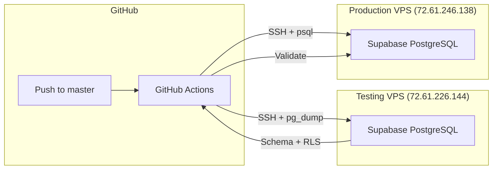

# Supabase CI/CD Pipeline Documentation

## 📋 Overview

This CI/CD pipeline automates the migration of Supabase database schemas and RLS policies from a **testing environment** to a **production environment** whenever code is pushed to the `master` branch.

### Architecture Diagram



### What Gets Migrated

| Component | Migrated | Notes |
|-----------|----------|-------|
| Table schemas | ✅ | Structure only, no data |
| RLS policies | ✅ | Row-level security rules |
| Functions | ✅ | Custom PostgreSQL functions |
| Extensions | ✅ | pg_uuid, etc. |
| Indexes | ✅ | Included in schema |
| **Data** | ❌ | Intentionally excluded |

---

## 🔧 Infrastructure Details

### Testing Server
- **VPS IP:** `72.61.226.144`
- **PostgreSQL Container:** `supabase-db-lcs8k80cgc4wocgg4gs8owgo`
- **Management:** Coolify

### Production Server
- **VPS IP:** `72.61.246.138`
- **PostgreSQL Container:** `supabase-db-xgcogw0wkcswsgg4o404ow4w`
- **Management:** Coolify

---

## 🚀 GitHub Setup Guide (Manual Steps Required)

### Step 1: Add Repository Secrets

Go to your GitHub repository → **Settings** → **Secrets and variables** → **Actions** → **New repository secret**

| Secret Name | Value | Description |
|------------|-------|-------------|
| `VPS_SSH_PRIVATE_KEY` | Contents of `C:\Users\admin\.ssh\github_deploy_key` | SSH private key for VPS access |

**To get your SSH private key:**
```powershell
# Run this in PowerShell to copy the key content
Get-Content C:\Users\admin\.ssh\github_deploy_key
```

### Step 2: Create Production Environment

1. Go to repository → **Settings** → **Environments**
2. Click **New environment**
3. Name it: `production`
4. (Optional) Add protection rules:
   - ☑ Required reviewers
   - ☑ Wait timer (e.g., 5 minutes)

### Step 3: Verify Workflow File

Ensure the file `.github/workflows/supabase-migration.yml` is committed to your repository.

### Step 4: Test the Pipeline

1. Make a commit to the `master` branch
2. Go to repository → **Actions** tab
3. Watch the workflow run

---

## 📁 File Structure

```
project_Crawler/
├── .github/
│   └── workflows/
│       └── supabase-migration.yml    # GitHub Actions workflow
├── scripts/
│   └── cicd/
│       ├── extract_schema.sh         # Extract schema from testing
│       ├── apply_schema.sh           # Apply schema to production
│       ├── validate_deployment.sh    # Validate deployment
│       └── rollback.sh               # Rollback on failure
├── migration_output/                  # Generated migration files
├── backups/                          # Production backups
└── reports/                          # Validation reports
```

---

## 🔄 Pipeline Workflow

### Automatic Trigger (on push to master)

```
1. Extract Schema from Testing
   ├── Connect via SSH
   ├── Run pg_dump --schema-only
   ├── Extract RLS policies
   └── Upload as artifact

2. Validate Extracted Schema
   ├── Check for table definitions
   └── Block if destructive operations found

3. Apply to Production
   ├── Create backup of production
   ├── Apply schema (non-destructive)
   ├── Apply RLS policies
   └── Cleanup temp files

4. Validate Deployment
   ├── Verify schema presence
   ├── Check RLS policies active
   ├── Database health check
   └── Generate report
```

### Manual Trigger with Dry Run

Go to **Actions** → **Supabase Schema Migration** → **Run workflow** → Check **Perform dry run only**

---

## 🛠 Local Script Usage

### Extract Schema from Testing

```bash
# Set environment variables
export SSH_KEY_PATH="C:\Users\admin\.ssh\github_deploy_key"
export TESTING_VPS_IP="72.61.226.144"
export TESTING_DB_CONTAINER="supabase-db-lcs8k80cgc4wocgg4gs8owgo"

# Run extraction
bash scripts/cicd/extract_schema.sh
```

### Apply Schema to Production (Dry Run)

```bash
export SSH_KEY_PATH="C:\Users\admin\.ssh\github_deploy_key"
export PRODUCTION_VPS_IP="72.61.246.138"
export PRODUCTION_DB_CONTAINER="supabase-db-xgcogw0wkcswsgg4o404ow4w"

# Dry run first
bash scripts/cicd/apply_schema.sh --dry-run

# Apply when ready
bash scripts/cicd/apply_schema.sh
```

### Validate Deployment

```bash
bash scripts/cicd/validate_deployment.sh
```

### Rollback

```bash
# List available backups
bash scripts/cicd/rollback.sh --list

# Rollback to latest
bash scripts/cicd/rollback.sh

# Rollback to specific backup
bash scripts/cicd/rollback.sh --backup ./backups/production_backup_20260128_120000.sql
```

---

## ⚠️ Common Issues & Fixes

### Issue 1: SSH Connection Timeout

**Symptoms:**
```
ssh: connect to host 72.61.226.144 port 22: Connection timed out
```

**Solutions:**
1. Verify VPS is running and accessible
2. Check firewall rules allow port 22
3. Verify SSH key is correct

### Issue 2: Permission Denied (publickey)

**Symptoms:**
```
Permission denied (publickey)
```

**Solutions:**
1. Ensure SSH key is added to the server's `~/.ssh/authorized_keys`
2. Verify the secret `VPS_SSH_PRIVATE_KEY` contains the full private key
3. Check key permissions (should be 600)

### Issue 3: Container Not Found

**Symptoms:**
```
Error: No such container: supabase-db-xxx
```

**Solutions:**
1. SSH into VPS and run `docker ps` to find the correct container name
2. Update the container name in the workflow file

### Issue 4: Schema Already Exists

**Symptoms:**
```
ERROR: relation "table_name" already exists
```

**This is expected and safe.** The workflow uses `ON_ERROR_STOP=0` to continue despite these errors. Only new objects will be created.

### Issue 5: RLS Policy Conflict

**Symptoms:**
```
ERROR: policy "policy_name" for table "table_name" already exists
```

**Solutions:**
1. Policies need to be dropped before re-creating
2. Consider adding `DROP POLICY IF EXISTS` statements

---

## 🔒 Security Considerations

| ✅ Safe Practices | ❌ Avoided Risks |
|------------------|------------------|
| SSH key stored in GitHub Secrets | Keys never logged |
| Schema-only migration | No production data exposed |
| Backup before apply | Rollback capability |
| Validation after deploy | Failed deploys detected |
| Production environment protection | Accidental deploys blocked |

---

## 📊 Validation Checklist

After each deployment, verify:

- [ ] Tables exist in production
- [ ] RLS is enabled on appropriate tables
- [ ] Policies are active
- [ ] Database responds to queries
- [ ] Supabase services are healthy
- [ ] Application functions correctly

---

## 🆘 Emergency Procedures

### Immediate Rollback

```bash
# SSH to production
ssh -i C:\Users\admin\.ssh\github_deploy_key root@72.61.246.138

# Quick rollback command (if schema causes issues)
docker exec -i supabase-db-xgcogw0wkcswsgg4o404ow4w psql -U postgres -d postgres < /path/to/backup.sql
```

### Stop Production Supabase

```bash
ssh -i C:\Users\admin\.ssh\github_deploy_key root@72.61.246.138

# Via Coolify UI or:
docker stop supabase-db-xgcogw0wkcswsgg4o404ow4w
```

---

## 📞 Support

For issues with:
- **GitHub Actions**: Check the Actions tab for logs
- **VPS/Docker**: SSH into the server and check `docker logs <container>`
- **Database**: Connect via psql and check `pg_stat_activity`
