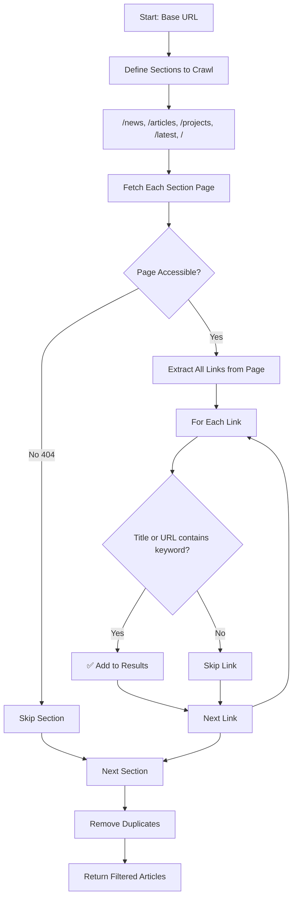

# Active Crawling: How It Works

## Overview

Active Crawling (Option 1) is the **primary and most reliable** method for discovering article URLs. It works by crawling predefined website sections and filtering articles based on keywords.

---

## How Active Crawling Works



---

## Step-by-Step Process

### Step 1: Define Sections to Crawl
The crawler visits these common website sections:

| Section | Purpose |
|---------|---------|
| `/news` | Latest news articles |
| `/articles` | Full articles section |
| `/projects` | Project announcements |
| `/latest` | Most recent content |
| `/industry-news` | Industry-specific news |
| `/construction` | Construction-related content |
| `/` | Homepage (catches featured articles) |

### Step 2: Fetch Section Pages
```python
# For each section, make HTTP request
section_url = urljoin(base_url, "/news")
response = session.get(section_url)
html = response.text
```

### Step 3: Extract All Links
```python
# Parse HTML and find all <a> tags
soup = BeautifulSoup(html, 'lxml')
all_links = soup.find_all('a', href=True)

# Example: finds 193 links on a typical page
```

### Step 4: Filter by Keywords
```python
# Keywords from keywords.json
keywords = ['chemical plant', 'petrochemical', 'refinery', 
            'EPCM', 'EPC', 'construction', 'hydrogen', ...]

# For each link, check if title OR URL contains any keyword
for link in all_links:
    title = link.get_text()
    url = link['href']
    
    text_to_check = (title + url).lower()
    
    if any(keyword in text_to_check for keyword in keywords):
        # ✅ This article matches!
        results.append({
            'url': url,
            'title': title,
            'matched_keywords': matching_keywords
        })
```

### Step 5: Remove Duplicates
```python
# Same article might appear in multiple sections
# Keep only unique URLs
unique_articles = []
seen_urls = set()

for article in all_articles:
    if article['url'] not in seen_urls:
        seen_urls.add(article['url'])
        unique_articles.append(article)
```

---

## Example: Keyword Matching

| Article Title | URL | Matching Keywords | Result |
|--------------|-----|-------------------|--------|
| "AES Andes abandons $10-B green **hydrogen project**" | /news/2026/01/aes-andes... | `hydrogen`, `project` | ✅ Match |
| "Optimizing **project** management in megaprojects" | /magazine/.../plant-design-**construction**... | `project`, `construction` | ✅ Match |
| "Subscribe to our newsletter" | /subscribe | None | ❌ Skip |
| "About Us" | /about | None | ❌ Skip |

---

## Keywords Configuration

Keywords are loaded from `data/keywords.json`:

```json
{
  "segment_keywords": [
    "chemical plant", "petrochemical", "refinery",
    "polymer plant", "specialty chemicals", "EPCM", 
    "EPC", "construction"
  ],
  "subsegment_keywords": [
    "ethylene", "propylene", "ammonia", "methanol",
    "hydrogen", "benzene", "toluene"
  ]
}
```

---

## Advantages of Active Crawling

| Feature | Benefit |
|---------|---------|
| ✅ No JavaScript needed | Works with simple HTTP requests |
| ✅ No API required | Doesn't depend on site having public API |
| ✅ Fast | Direct HTML parsing is quick |
| ✅ Reliable | Standard HTML structure across sites |
| ✅ Industry standard | How most web scrapers work |
| ✅ No browser automation | No Selenium/Playwright needed |

---

## Output Format

Each discovered article includes:

```json
{
  "url": "https://www.hydrocarbonprocessing.com/news/2026/01/...",
  "title": "AES Andes abandons $10-B green hydrogen project",
  "source_name": "Hydrocarbon Processing",
  "discovered_via": "active_crawl",
  "discovered_in_section": "/news",
  "section_url": "https://www.hydrocarbonprocessing.com/news"
}
```

---

## Test Results

| Site | Sections Crawled | Links Found | **Keyword Matches** |
|------|------------------|-------------|---------------------|
| hydrocarbonprocessing.com | 7 | 193+ | **14 articles** |
| cen.acs.org | 6 | 193 | **1 article** |

---

## When to Use Fallbacks

Active crawling may find few results when:
- Site has unusual URL structure
- Content is behind login/paywall
- Articles don't contain target keywords

In these cases, fallback to:
- **Option 2**: Search API Discovery
- **Option 3**: Selenium Browser Automation
